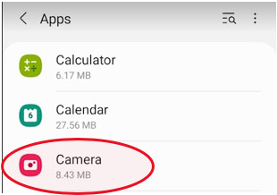

= Challenge 1

Your first challenge awaits! 

In this challenge, we want to get an idea of your writing style as it relates to software and computer technology.

== Instructions

. Choose any software or application that you use regularly.
. Write instructions on how to perform a common task related to the software or application.

.Example please?
****
Some ideas to get you started:

* Sending an attachment in link:https://signal.org/[Signal^].
* Forwarding an email with link:https://www.google.com/gmail/about/[Gmail^].
* Publishing a blog post with link:https://wordpress.com/[Wordpress^].
* Adding an extension to link:https://code.visualstudio.com/[Visual Studio Code^].
* Taking a screenshot with an link:https://www.apple.com/iphone/[iPhone^].
****

TIP: Keep the task concise. There's no need to over-complicate the instructions.

== Answer

// your answer goes here

=== Taking a Selfie Using the Palm of your Hand

If you want to take a picture of yourself, a selfie, using your mobile phone without having to press a button to take the photo, follow the instructions below.

Firstly, your phone has to be configured to take photos using your palm. Not all mobile phones have this feature. Secondly, you need to open your camera and turn on the selfie mode. Both of these steps are described in detail below.

==== Shooting Method Setup

. Firstly, go to your *mobile phone Settings*, and then to “Apps”: 
+

. Find the “Camera” app and tap on it:
+

. Inside the Camera app, tap on the “Camera settings” option:
+

. Next tap on the “Shooting methods” option:
+
image::camera-settings.png[role="zoom"]
. Finally, make sure the option “Show palm” is turned on:
+

NOTE: If you don’t see this option under the shooting methods, your camera probably can’t be configured to take a selfie using your palm. 

==== Changing to Selfie Mode and Taking the Snap

. Open your camera by tapping the camera icon:
+
image::camera-icon.png[role="zoom"]
. Switch to selfie mode by tapping the icon to turn the camera around:
+

. Now you should see yourself on the camera, hold up the palm of your hand so that it is roughly in the center of the photo, as illustrated in the picture below:
+

Hey presto, a shutter icon will indicate a short countdown before the picture is taken.
Note: If you are not using a Samsung A41, you might need to check with the manufacturer's instructions for your particular mobile.