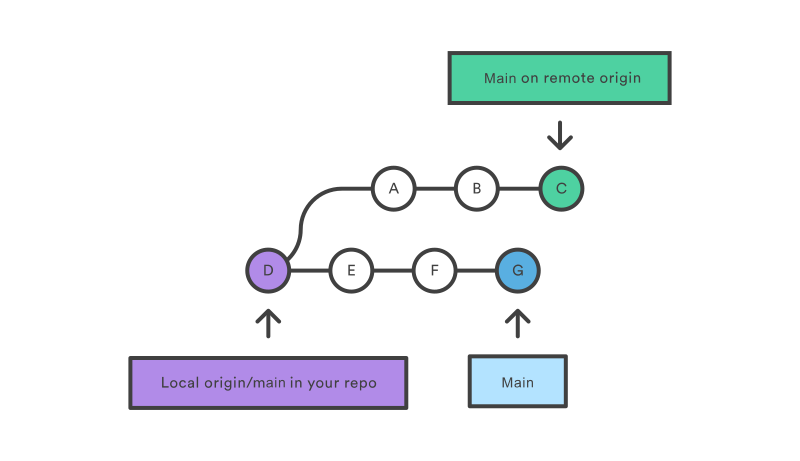

= Challenge 2

Your second challenge awaits! 

In this challenge, we want to see how comfortable you are explaining a technical topic.

Your audience is someone technical, but new to link:https://en.wikipedia.org/wiki/Version_control[version control^].

== Instructions

. Explain what a merge request/pull request is.
. Give examples on how to use it.

== Answer

// your answer goes here

=== Merge and Pull Requests

You know already that Git allows you to track changes in any set of files. For instance, a programmer may commit code into a repository.

This repository may have several branches, for example, relating to various fixes and features, which different people may have done.

image::git-branches-merge.png[width=400]

A merge or pull request is required to combine branches after work is complete in the respective branches depending on what needs to be merged. To refresh your knowledge on Git and tracking what has been done, read further here: https://www.nobledesktop.com/blog/what-is-git-and-why-should-you-use-it[What is Git]

==== Merging
In the graphic below, two branches from the master branch are shown. A hotfix branch and a feature development branch called "iss53".

image::basic-branching-4.png[width=400]

To combine the hotfix branch into the master branch, we first checkout the master branch and then perform the merge command:
[source,git]
----
$ git checkout master
$ git merge hotfix
----

For more information about conflicts when merging and the merge procedure itself, please refer to: link:https://git-scm.com/book/en/v2/Git-Branching-Basic-Branching-and-Merging[Basic Branching and Merging]

==== Pulling a Branch
In contrast to the merging described above, pulling a branch is a combination of fetching a remote repository and merging it with a local repository `git fetch + git merge`. 
A local branch and a remote branch are depicted in the graphic below. The branches diverge after point "D", and merging the remote one into the local branch would create a new point in the local branch containing all the remote points.

The command to pull a remote branch in this way is:
[source,git]
----
$ git pull <remote_repository>
----

For more information on standard options, please refer to: link:https://www.atlassian.com/git/tutorials/syncing/git-pull[git pull]